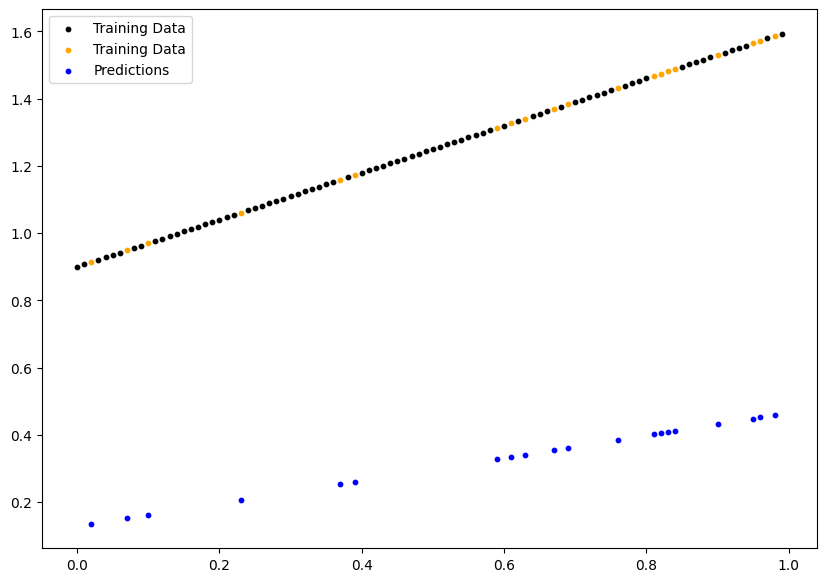
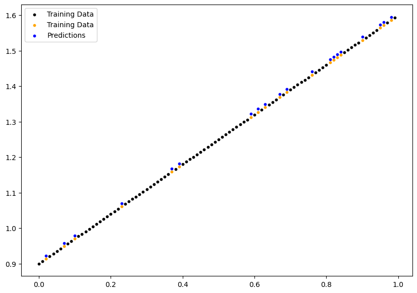
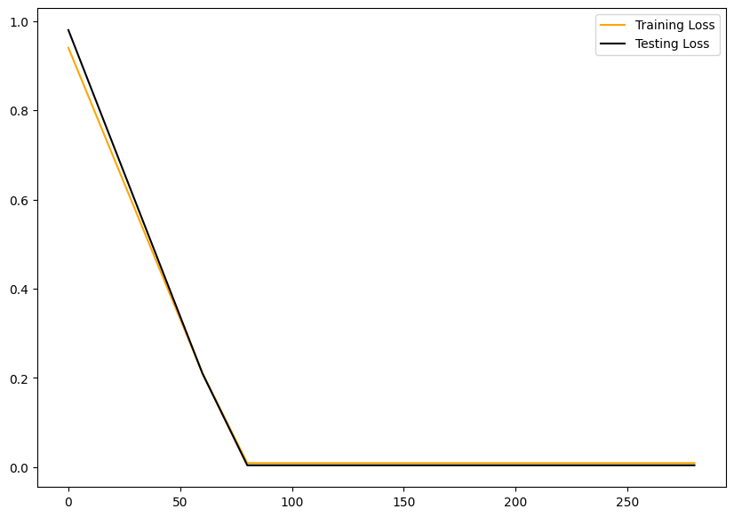
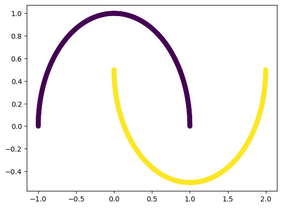
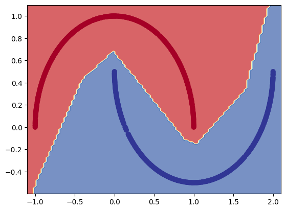
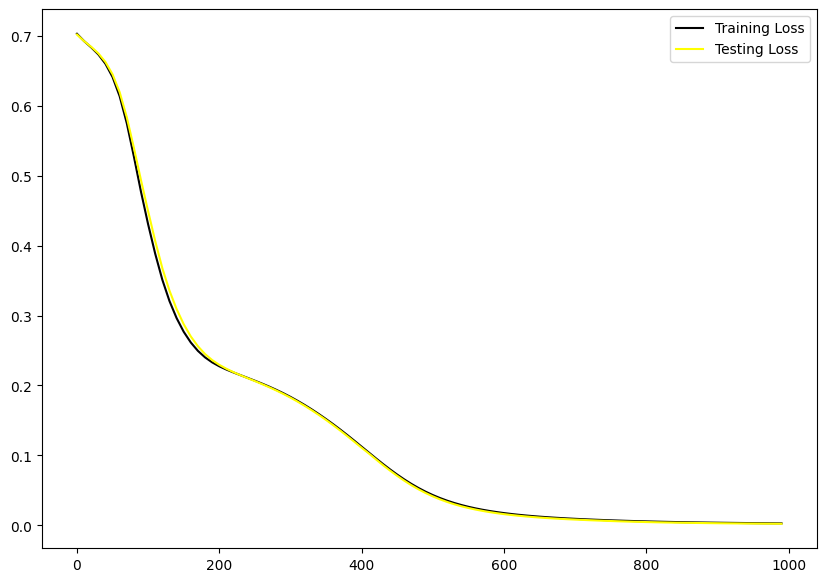
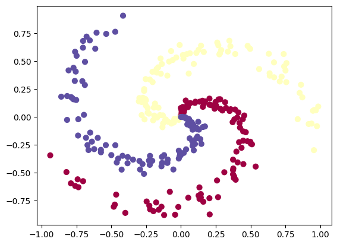
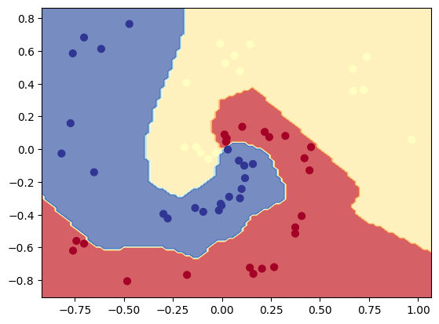
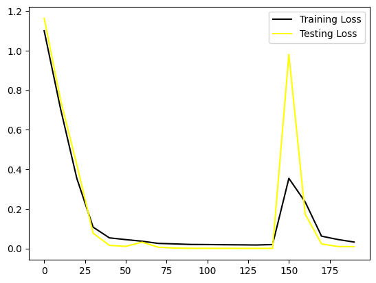

# PyTorch Deep Learning Models: Regression & Classification

This repository demonstrates the implementation of various deep learning models using PyTorch, focusing on regression and classification tasks.


## 🎯 Project Overview

This project implements three main types of models:
- Linear Regression
- Binary Classification (Moon Dataset)
- Multi-class Classification (Spiral Dataset)

## 📊 Models & Results

### 1. Linear Regression
A simple linear regression model implementing y = Wx + b

#### Initial State vs Trained Model
<p float="left">
  
  
</p>

#### Training Details
- **Loss Function**: L1Loss (Mean Absolute Error)
  ```
  L1(y, ŷ) = |y - ŷ|
  ```
- **Optimizer**: Stochastic Gradient Descent (SGD)
  ```
  w = w - learning_rate * gradient
  ```
- **Learning Rate**: 0.01
- **Epochs**: 300

#### Loss Curve


### 2. Binary Classification (Moon Dataset)
Implementation of binary classification using a neural network on the make_moons dataset.

#### Model Evolution
<p float="left">
  
  
</p>

#### Model Architecture
```python
Sequential(
    Linear(2 → 10)
    ReLU()
    Linear(10 → 10)
    ReLU()
    Linear(10 → 10)
    ReLU()
    Linear(10 → 1)
)
```

#### Training Details
- **Loss Function**: Binary Cross Entropy with Logits
  ```
  BCE(x, y) = -[y * log(σ(x)) + (1 - y) * log(1 - σ(x))]
  ```
- **Optimizer**: SGD
- **Learning Rate**: 0.1
- **Epochs**: 1000

#### Loss Curve


### 3. Multi-class Classification (Spiral Dataset)
Implementation of multi-class classification on a spiral dataset.

#### Model Evolution
<p float="left">
  
  
</p>

#### Model Architecture
```python
Sequential(
    Linear(2 → 10)
    ReLU()
    Linear(10 → 10)
    ReLU()
    Linear(10 → 10)
    ReLU()
    Linear(10 → 3)
)
```

#### Training Details
- **Loss Function**: Cross Entropy Loss
  ```
  CE(x, y) = -Σ y_i * log(softmax(x_i))
  ```
- **Optimizer**: Adam
  ```
  m_t = β_1 * m_{t-1} + (1 - β_1) * g_t
  v_t = β_2 * v_{t-1} + (1 - β_2) * g_t^2
  ```
- **Learning Rate**: 0.1
- **Epochs**: 200

#### Loss Curve


## 🚀 Getting Started

### Prerequisites
- Python 3.8+
- PyTorch
- scikit-learn
- matplotlib
- numpy

### Installation
```bash
git clone https://github.com/yourusername/pytorch-regression-classification.git
cd pytorch-regression-classification
pip install -r requirements.txt
```

### Running the Models
```bash
jupyter notebook notebook.ipynb
```

## 📈 Key Features

- Implementation of three different types of neural networks
- Visualization of decision boundaries
- Loss curve tracking and visualization
- Model performance analysis
- Comprehensive documentation

## 🛠️ Built With
- [PyTorch](https://pytorch.org/) - Deep Learning Framework
- [scikit-learn](https://scikit-learn.org/) - Dataset Generation
- [Matplotlib](https://matplotlib.org/) - Visualization
- [NumPy](https://numpy.org/) - Numerical Computations

## 📝 License
This project is licensed under the MIT License - see the [LICENSE.md](LICENSE.md) file for details

## 🤝 Contributing
Contributions, issues, and feature requests are welcome! Feel free to check [issues page](link-to-issues).